# Studify Database ERD (Entity Relationship Diagram)

This document contains the Entity Relationship Diagram for the Studify application database structure.

> **Note**: This ERD uses Mermaid syntax. To view the diagram, use a markdown viewer that supports Mermaid (like GitHub, GitLab, VS Code with Mermaid extension, or online Mermaid editors).

## Complete Database ERD

This ERD shows all 33 database tables and their relationships as defined in the BACKEND_PROMPT.md file.

```mermaid
erDiagram
    %% User Management Tables
    User ||--o| StudentProfile : "has"
    User ||--o| Student : "has"
    User ||--o| Doctor : "has"
    User ||--o| DeliveryProfile : "has"
    User ||--o| AdminProfile : "has"
    User ||--o| WholesaleCustomer : "has"
    User ||--o{ UserRolePermission : "has"
    User ||--o{ Address : "has"
    User ||--o{ Order : "places"
    User ||--o{ Review : "writes"
    User ||--o{ ProductReview : "writes"
    User ||--o{ Notification : "receives"
    User ||--o| Cart : "has"
    User ||--o{ Enrollment : "enrolls"
    User ||--o{ Course : "instructs"
    User ||--o{ CustomerRating : "rates_as_delivery"
    User ||--o{ CustomerRating : "rated_as_customer"
    User ||--o{ SearchHistory : "searches"
    User ||--o{ OTP : "has"

    Student ||--o{ Enrollment : "enrolls_in"
    
    Doctor ||--o{ Course : "creates"
    Doctor ||--o{ ProductReview : "reviews"
    
    DeliveryProfile ||--o{ DeliveryAssignment : "handles"
    DeliveryProfile ||--o{ Payout : "receives"

    %% Role & Permission System
    Role ||--o{ RolePermission : "has"
    Role ||--o{ UserRolePermission : "assigned_to"
    Permission ||--o{ RolePermission : "granted_to"

    %% Category System
    Category ||--o{ Category : "parent_of"
    Category ||--o{ Course : "categorizes"
    Category ||--o{ Product : "categorizes"

    %% Course System
    Course ||--o{ Lesson : "contains"
    Course ||--o{ Review : "has"
    Course ||--o{ Enrollment : "enrolled_by"
    Course ||--o{ CartItem : "added_to_cart"
    Course ||--o{ OrderItem : "ordered_as"

    Lesson ||--o{ LessonProgress : "tracked_in"

    %% Product System
    Product ||--o{ ProductImage : "has"
    Product ||--o{ ProductReview : "has"
    Product ||--o{ CartItem : "added_to_cart"
    Product ||--o{ OrderItem : "ordered_as"

    %% Cart System
    Cart ||--o{ CartItem : "contains"

    %% Order System
    Order ||--o{ OrderItem : "contains"
    Order ||--o| Payment : "has"
    Order ||--o| DeliveryAssignment : "assigned_to"
    Order ||--o{ OrderStatusHistory : "tracks"
    Order ||--o| CustomerRating : "rated"
    Order ||--o{ Payout : "included_in"
    Address ||--o{ Order : "delivered_to"

    %% Enrollment & Progress
    Enrollment ||--o{ LessonProgress : "tracks"

    %% Standalone Tables
    ProductImportLog {
        string id PK
        string fileName
        string filePath
        string fileType
        int totalRows
        int successCount
        int errorCount
        string status
        json errors
        string importedBy FK
        datetime startedAt
        datetime completedAt
    }

    Report {
        string id PK
        string name
        string type
        string format
        json parameters
        string filePath
        string fileUrl
        string status
        string generatedBy FK
        datetime startedAt
        datetime completedAt
        datetime expiresAt
    }

    %% Entity Definitions with Key Attributes
    User {
        string id PK
        string name
        string email UK
        string phoneNumber UK
        string passwordHash
        string gender
        datetime dateOfBirth
        string location
        string profilePictureUrl
        string role
        boolean isActive
        boolean emailVerified
        boolean phoneVerified
        datetime createdAt
        datetime updatedAt
    }

    Student {
        string id PK
        string userId FK
        string studentId UK
        datetime enrollmentDate
        datetime graduationDate
        string level
        int totalCoursesCompleted
        int totalPoints
        string preferredLanguage
        text notes
        datetime createdAt
        datetime updatedAt
    }

    Doctor {
        string id PK
        string userId FK
        string doctorId UK
        string specialization
        text qualifications
        int experience
        string licenseNumber
        datetime licenseExpiry
        text bio
        array expertise
        array languages
        decimal consultationFee
        float rating
        int totalReviews
        int totalStudents
        int totalCourses
        boolean isVerified
        datetime verificationDate
        json documents
        json bankDetails
        datetime createdAt
        datetime updatedAt
    }

    StudentProfile {
        string id PK
        string userId FK
        datetime createdAt
        datetime updatedAt
    }

    DeliveryProfile {
        string id PK
        string userId FK
        string vehicleType
        string licenseNumber
        string bankAccountNumber
        string bankAccountName
        string bankName
        string idDocumentUrl
        string licenseDocumentUrl
        string vehicleDocumentUrl
        boolean isAvailable
        float rating
        int totalDeliveries
        datetime createdAt
        datetime updatedAt
    }

    AdminProfile {
        string id PK
        string userId FK
        json permissions
        datetime createdAt
        datetime updatedAt
    }

    WholesaleCustomer {
        string id PK
        string userId FK
        string companyName
        string taxId UK
        string businessLicense
        string contactPerson
        string discountTier
        decimal discountPercentage
        decimal creditLimit
        string paymentTerms
        boolean isApproved
        string approvedBy
        datetime approvedAt
        text notes
        datetime createdAt
        datetime updatedAt
    }

    Role {
        string id PK
        string name UK
        string slug UK
        text description
        boolean isSystem
        datetime createdAt
        datetime updatedAt
    }

    Permission {
        string id PK
        string name UK
        string slug UK
        string resource
        string action
        text description
        datetime createdAt
    }

    RolePermission {
        string id PK
        string roleId FK
        string permissionId FK
        datetime createdAt
    }

    UserRolePermission {
        string id PK
        string userId FK
        string roleId FK
        string grantedBy
        datetime expiresAt
        datetime createdAt
        datetime updatedAt
    }

    Category {
        string id PK
        string name UK
        string iconUrl
        string slug UK
        string type
        string parentId FK
        text description
        boolean isActive
        int sortOrder
        datetime createdAt
        datetime updatedAt
    }

    Course {
        string id PK
        string title
        text description
        decimal price
        string imageUrl
        string videoUrl
        string instructorId FK
        string categoryId FK
        float rating
        int numberOfReviews
        string status
        datetime createdAt
        datetime updatedAt
    }

    Lesson {
        string id PK
        string courseId FK
        string title
        text description
        text content
        string contentType
        int orderIndex
        int duration
        datetime createdAt
        datetime updatedAt
    }

    Product {
        string id PK
        string name
        string sku UK
        string barcode UK
        text description
        text shortDescription
        decimal retailPrice
        decimal wholesalePrice
        decimal costPrice
        string imageUrl
        array gallery
        int stockQuantity
        int lowStockThreshold
        boolean manageStock
        string stockStatus
        string categoryId FK
        string brand
        decimal weight
        string dimensions
        string unit
        int minWholesaleQuantity
        json wholesaleTiers
        boolean allowWholesale
        string status
        string slug UK
        string metaTitle
        text metaDescription
        json attributes
        json variations
        float rating
        int numberOfReviews
        int totalSales
        datetime createdAt
        datetime updatedAt
        datetime publishedAt
    }

    ProductImage {
        string id PK
        string productId FK
        string imageUrl
        string altText
        int sortOrder
        boolean isPrimary
        datetime createdAt
    }

    Review {
        string id PK
        string courseId FK
        string userId FK
        int rating
        text comment
        datetime createdAt
        datetime updatedAt
    }

    ProductReview {
        string id PK
        string productId FK
        string userId FK
        string doctorId FK
        int rating
        string title
        text comment
        boolean verifiedPurchase
        int helpful
        datetime createdAt
        datetime updatedAt
    }

    Cart {
        string id PK
        string userId FK
        datetime createdAt
        datetime updatedAt
    }

    CartItem {
        string id PK
        string cartId FK
        string itemType
        string courseId FK
        string productId FK
        int quantity
        boolean isWholesale
        datetime createdAt
    }

    Address {
        string id PK
        string userId FK
        string street
        string city
        string state
        string zipCode
        string country
        boolean isDefault
        float latitude
        float longitude
        datetime createdAt
        datetime updatedAt
    }

    Order {
        string id PK
        string userId FK
        string deliveryAddressId FK
        string paymentMethod
        string orderType
        decimal subtotal
        decimal discountAmount
        decimal taxAmount
        decimal shippingAmount
        decimal totalAmount
        string status
        string deliveryPersonId FK
        string orderNumber UK
        text notes
        boolean isWholesale
        decimal wholesaleDiscount
        datetime createdAt
        datetime updatedAt
    }

    OrderItem {
        string id PK
        string orderId FK
        string itemType
        string courseId FK
        string productId FK
        decimal priceAtPurchase
        int quantity
        boolean isWholesale
        decimal discountAmount
        decimal subtotal
        datetime createdAt
    }

    Payment {
        string id PK
        string orderId FK
        string transactionId
        decimal amount
        string status
        datetime paymentDate
        datetime createdAt
        datetime updatedAt
    }

    DeliveryAssignment {
        string id PK
        string orderId FK
        string deliveryPersonId FK
        string status
        string pickupLocation
        string deliveryLocation
        float pickupLatitude
        float pickupLongitude
        float deliveryLatitude
        float deliveryLongitude
        decimal estimatedEarnings
        datetime acceptedAt
        datetime pickedUpAt
        datetime deliveredAt
        datetime createdAt
        datetime updatedAt
    }

    Payout {
        string id PK
        string deliveryPersonId FK
        decimal amount
        string status
        datetime periodStart
        datetime periodEnd
        string transactionId
        datetime payoutDate
        datetime createdAt
        datetime updatedAt
    }

    OrderStatusHistory {
        string id PK
        string orderId FK
        string status
        string changedBy
        text notes
        datetime createdAt
    }

    Notification {
        string id PK
        string userId FK
        string title
        text message
        string type
        boolean isRead
        string relatedId
        datetime createdAt
    }

    Enrollment {
        string id PK
        string userId FK
        string courseId FK
        string orderId FK
        datetime enrolledAt
        datetime completedAt
        int progress
    }

    LessonProgress {
        string id PK
        string enrollmentId FK
        string lessonId FK
        boolean isCompleted
        datetime completedAt
        int timeSpent
        datetime createdAt
        datetime updatedAt
    }

    CustomerRating {
        string id PK
        string orderId FK
        string deliveryPersonId FK
        string customerId FK
        int rating
        text comment
        datetime createdAt
    }

    SearchHistory {
        string id PK
        string userId FK
        string query
        datetime createdAt
    }

    OTP {
        string id PK
        string userId FK
        string code
        string type
        datetime expiresAt
        boolean isUsed
        datetime createdAt
    }
```

## ERD Legend

### Relationship Types:
- `||--o|` : One-to-Zero-or-One (Optional One)
- `||--o{` : One-to-Many (One-to-Zero-or-More)
- `||--||` : One-to-One (Mandatory)
- `}o--o{` : Many-to-Many

### Key Symbols:
- `PK` : Primary Key
- `FK` : Foreign Key
- `UK` : Unique Key

## Database Tables Summary

### Total Tables: 33

#### User Management (8 tables)
1. User (Base user table)
2. Student
3. Doctor
4. StudentProfile (Legacy)
5. DeliveryProfile
6. AdminProfile
7. WholesaleCustomer
8. OTP

#### Role & Permissions (4 tables)
9. Role
10. Permission
11. RolePermission
12. UserRolePermission

#### Categories (1 table)
13. Category (Self-referencing for hierarchy)

#### Courses (3 tables)
14. Course
15. Lesson
16. Review

#### Products (4 tables)
17. Product
18. ProductImage
19. ProductReview
20. ProductImportLog

#### Shopping & Orders (6 tables)
21. Cart
22. CartItem
23. Address
24. Order
25. OrderItem
26. Payment

#### Delivery (2 tables)
27. DeliveryAssignment
28. Payout

#### Learning Progress (2 tables)
29. Enrollment
30. LessonProgress

#### Other (3 tables)
31. Notification
32. OrderStatusHistory
33. CustomerRating
34. SearchHistory
35. Report

## Key Relationships

### User Relationships:
- User → Student (1:1)
- User → Doctor (1:1)
- User → DeliveryProfile (1:1)
- User → AdminProfile (1:1)
- User → WholesaleCustomer (1:1)
- User → Cart (1:1)
- User → Orders (1:Many)
- User → Addresses (1:Many)
- User → Enrollments (1:Many)
- User → Reviews (1:Many)
- User → Notifications (1:Many)
- User → UserRolePermission (1:Many)

### Course Relationships:
- Course → Lesson (1:Many)
- Course → Review (1:Many)
- Course → Enrollment (1:Many)
- Course → OrderItem (1:Many)
- Course → CartItem (1:Many)
- Category → Course (1:Many)
- Doctor → Course (1:Many)

### Product Relationships:
- Product → ProductImage (1:Many)
- Product → ProductReview (1:Many)
- Product → OrderItem (1:Many)
- Product → CartItem (1:Many)
- Category → Product (1:Many)

### Order Relationships:
- Order → OrderItem (1:Many)
- Order → Payment (1:1)
- Order → DeliveryAssignment (1:1)
- Order → OrderStatusHistory (1:Many)
- Order → CustomerRating (1:1)
- Address → Order (1:Many)

### Enrollment Relationships:
- Enrollment → LessonProgress (1:Many)
- Student → Enrollment (1:Many)
- Course → Enrollment (1:Many)

### Delivery Relationships:
- DeliveryProfile → DeliveryAssignment (1:Many)
- DeliveryProfile → Payout (1:Many)
- Order → DeliveryAssignment (1:1)
- Order → Payout (Many:Many through junction)

### Role & Permission Relationships:
- Role → RolePermission (1:Many)
- Permission → RolePermission (1:Many)
- Role → UserRolePermission (1:Many)
- User → UserRolePermission (1:Many)

## Notes

1. **Category Hierarchy**: The Category table has a self-referencing relationship (`parentId`) to support parent-child category structures.

2. **Polymorphic Relationships**: 
   - `CartItem` and `OrderItem` support both Courses and Products through `itemType` field
   - They have optional foreign keys to both `courseId` and `productId`

3. **User Profile Tables**: The system uses separate tables (Student, Doctor, DeliveryProfile, AdminProfile, WholesaleCustomer) that have one-to-one relationships with the base User table.

4. **Order System**: Orders can contain both courses and products, indicated by the `orderType` field and the polymorphic `OrderItem` table.

5. **Rating System**: 
   - Courses have reviews (Review table)
   - Products have reviews (ProductReview table)
   - Customers can be rated by delivery personnel (CustomerRating table)

6. **Role-Based Access Control**: The system implements RBAC with Roles, Permissions, and junction tables for flexible permission management.

