# Studify Database ERD - Refactored (Professional Edition)

This is a refactored and improved ERD for the Studify platform, addressing domain separation, scalability, security, and maintainability concerns.

> **Note**: This ERD uses Mermaid syntax. View in a markdown viewer that supports Mermaid (GitHub, GitLab, VS Code with Mermaid extension, or mermaid.live).

## Refactored Database ERD

```mermaid
erDiagram
    %% ============================================
    %% DOMAIN 1: AUTH & IDENTITY
    %% ============================================
    User ||--o| Student : "has"
    User ||--o| Doctor : "has"
    User ||--o| DeliveryProfile : "has"
    User ||--o| AdminProfile : "has"
    User ||--o| WholesaleCustomer : "has"
    User ||--o{ UserRolePermission : "has"
    User ||--o{ LoginHistory : "has"
    User ||--o{ ActivityLog : "creates"
    User ||--o{ Address : "has"
    User ||--o{ OTP : "has"

    Role ||--o{ RolePermission : "has"
    Role ||--o{ UserRolePermission : "assigned_to"
    Permission ||--o{ RolePermission : "granted_to"
    
    User {
        string id PK
        string email UK
        string phoneNumber UK
        string passwordHash
        string name
        string gender
        datetime dateOfBirth
        string location
        string profilePictureUrl
        string defaultRoleId FK
        boolean isActive
        boolean emailVerified
        boolean phoneVerified
        datetime deletedAt
        datetime createdAt
        datetime updatedAt
    }

    Role {
        string id PK
        string name UK
        string slug UK
        text description
        boolean isSystem
        datetime createdAt
        datetime updatedAt
    }

    Permission {
        string id PK
        string name UK
        string slug UK
        string resource
        string action
        text description
        datetime createdAt
    }

    RolePermission {
        string id PK
        string roleId FK
        string permissionId FK
        datetime createdAt
    }

    UserRolePermission {
        string id PK
        string userId FK
        string roleId FK
        string grantedBy FK
        datetime expiresAt
        datetime createdAt
        datetime updatedAt
    }

    Student {
        string id PK
        string userId FK
        string studentId UK
        datetime enrollmentDate
        datetime graduationDate
        string level
        int totalCoursesCompleted
        int totalPoints
        string preferredLanguage
        text notes
        datetime createdAt
        datetime updatedAt
    }

    Doctor {
        string id PK
        string userId FK
        string doctorId UK
        string specialization
        text qualifications
        int experience
        string licenseNumber
        datetime licenseExpiry
        text bio
        array expertise
        array languages
        decimal consultationFee
        float rating
        int totalReviews
        int totalStudents
        int totalCourses
        boolean isVerified
        datetime verificationDate
        json documents
        json bankDetails
        datetime createdAt
        datetime updatedAt
    }

    DeliveryProfile {
        string id PK
        string userId FK
        string vehicleType
        string licenseNumber
        string bankAccountNumber
        string bankAccountName
        string bankName
        string idDocumentUrl
        string licenseDocumentUrl
        string vehicleDocumentUrl
        boolean isAvailable
        float rating
        int totalDeliveries
        datetime createdAt
        datetime updatedAt
    }

    AdminProfile {
        string id PK
        string userId FK
        json permissions
        datetime createdAt
        datetime updatedAt
    }

    WholesaleCustomer {
        string id PK
        string userId FK
        string companyName
        string taxId UK
        string businessLicense
        string contactPerson
        string discountTier
        decimal discountPercentage
        decimal creditLimit
        string paymentTerms
        boolean isApproved
        string approvedBy FK
        datetime approvedAt
        text notes
        datetime createdAt
        datetime updatedAt
    }

    OTP {
        string id PK
        string userId FK
        string code
        string type
        datetime expiresAt
        boolean isUsed
        datetime createdAt
    }

    LoginHistory {
        string id PK
        string userId FK
        string ipAddress
        string device
        string status
        string userAgent
        datetime createdAt
    }

    ActivityLog {
        string id PK
        string userId FK
        string action
        string entityType
        string entityId
        string ipAddress
        string userAgent
        json metadata
        datetime createdAt
    }

    Address {
        string id PK
        string userId FK
        string street
        string city
        string state
        string zipCode
        string country
        boolean isDefault
        float latitude
        float longitude
        datetime createdAt
        datetime updatedAt
    }

    %% ============================================
    %% DOMAIN 2: EDUCATION (LMS)
    %% ============================================
    Category ||--o{ Category : "parent_of"
    Category ||--o{ Course : "categorizes"
    Category ||--o{ Translation : "translated_as"
    
    Course ||--o{ Lesson : "contains"
    Course ||--o{ Enrollment : "enrolled_by"
    Course ||--o{ Translation : "translated_as"
    Course ||--o{ Rating : "rated_as"
    
    %% Note: CartItem and OrderItem use polymorphic relationships, not direct FK
    
    Lesson ||--o{ LessonProgress : "tracked_in"
    Lesson ||--o{ Translation : "translated_as"
    
    Enrollment ||--o{ LessonProgress : "tracks"
    
    Category {
        string id PK
        string name UK
        string iconUrl
        string slug UK
        string type
        string parentId FK
        text description
        boolean isActive
        int sortOrder
        datetime createdAt
        datetime updatedAt
    }

    Course {
        string id PK
        string title
        text description
        decimal price
        string imageUrl
        string videoUrl
        string instructorId FK
        string categoryId FK
        float rating
        int numberOfReviews
        string status
        datetime deletedAt
        datetime createdAt
        datetime updatedAt
        datetime publishedAt
    }

    Lesson {
        string id PK
        string courseId FK
        string title
        text description
        text content
        string contentType
        int orderIndex
        int duration
        datetime createdAt
        datetime updatedAt
    }

    Enrollment {
        string id PK
        string userId FK
        string courseId FK
        string orderId FK
        datetime enrolledAt
        datetime completedAt
        int progress
        datetime deletedAt
        datetime createdAt
        datetime updatedAt
    }

    LessonProgress {
        string id PK
        string enrollmentId FK
        string lessonId FK
        boolean isCompleted
        datetime completedAt
        int timeSpent
        datetime createdAt
        datetime updatedAt
    }

    Translation {
        string id PK
        string entityType
        string entityId
        string language
        string field
        text value
        datetime createdAt
        datetime updatedAt
    }

    %% ============================================
    %% DOMAIN 3: COMMERCE
    %% ============================================
    Category ||--o{ Product : "categorizes"
    
    Product ||--o{ ProductImage : "has"
    Product ||--o{ Translation : "translated_as"
    Product ||--o{ Rating : "rated_as"
    
    %% Note: CartItem and OrderItem use polymorphic relationships, not direct FK
    
    Cart ||--o{ CartItem : "contains"
    
    Order ||--o{ OrderItem : "contains"
    Order ||--o| Payment : "has"
    Order ||--o| Rating : "rated_as"
    Order ||--o{ OrderStatusHistory : "tracks"
    Address ||--o{ Order : "delivered_to"
    
    Payment ||--o{ PaymentHistory : "tracks"
    
    Product {
        string id PK
        string name
        string sku UK
        string barcode UK
        text description
        text shortDescription
        decimal retailPrice
        decimal wholesalePrice
        decimal costPrice
        string imageUrl
        array gallery
        int stockQuantity
        int lowStockThreshold
        boolean manageStock
        string stockStatus
        string categoryId FK
        string brand
        decimal weight
        string dimensions
        string unit
        int minWholesaleQuantity
        json wholesaleTiers
        boolean allowWholesale
        string status
        string slug UK
        string metaTitle
        text metaDescription
        json attributes
        json variations
        float rating
        int numberOfReviews
        int totalSales
        datetime deletedAt
        datetime createdAt
        datetime updatedAt
        datetime publishedAt
    }

    ProductImage {
        string id PK
        string productId FK
        string imageUrl
        string altText
        int sortOrder
        boolean isPrimary
        datetime createdAt
    }

    Cart {
        string id PK
        string userId FK
        datetime createdAt
        datetime updatedAt
    }

    CartItem {
        string id PK
        string cartId FK
        string itemableType
        string itemableId
        int quantity
        boolean isWholesale
        datetime createdAt
        datetime updatedAt
    }
    
    %% Note: CartItem uses polymorphic relationship
    %% itemableType: 'course' | 'product'
    %% itemableId: references Course.id or Product.id

    Order {
        string id PK
        string userId FK
        string deliveryAddressId FK
        string paymentMethod
        string orderType
        decimal subtotal
        decimal discountAmount
        decimal taxAmount
        decimal shippingAmount
        decimal totalAmount
        string status
        string orderNumber UK
        text notes
        boolean isWholesale
        decimal wholesaleDiscount
        datetime deletedAt
        datetime createdAt
        datetime updatedAt
    }

    OrderItem {
        string id PK
        string orderId FK
        string itemableType
        string itemableId
        decimal priceAtPurchase
        int quantity
        boolean isWholesale
        decimal discountAmount
        decimal subtotal
        datetime createdAt
    }
    
    %% Note: OrderItem uses polymorphic relationship
    %% itemableType: 'course' | 'product'
    %% itemableId: references Course.id or Product.id

    Payment {
        string id PK
        string orderId FK
        string transactionId UK
        string paymentGateway
        decimal amount
        string currency
        string status
        string failureReason
        json payload
        datetime paymentDate
        datetime refundedAt
        datetime deletedAt
        datetime createdAt
        datetime updatedAt
    }

    PaymentHistory {
        string id PK
        string paymentId FK
        string status
        string action
        json metadata
        datetime createdAt
    }

    OrderStatusHistory {
        string id PK
        string orderId FK
        string status
        string changedBy FK
        text notes
        datetime createdAt
    }

    %% ============================================
    %% DOMAIN 4: UNIFIED RATING SYSTEM
    %% ============================================
    Rating {
        string id PK
        string rateableType
        string rateableId
        string userId FK
        string doctorId FK
        int score
        string title
        text comment
        boolean verifiedPurchase
        int helpful
        datetime createdAt
        datetime updatedAt
    }

    User ||--o{ Rating : "rates"
    Doctor ||--o{ Rating : "rates_as_doctor"
    Course ||--o{ Rating : "rated_as"
    Product ||--o{ Rating : "rated_as"
    Order ||--o| Rating : "rated_as"
    DeliveryAssignment ||--o| Rating : "rated_as"
    
    %% Note: Rating uses polymorphic relationship
    %% rateableType: 'course' | 'product' | 'order' | 'delivery'
    %% rateableId: references Course.id, Product.id, Order.id, or DeliveryAssignment.id

    %% ============================================
    %% DOMAIN 5: DELIVERY
    %% ============================================
    DeliveryAssignment ||--o| Rating : "rated_as"
    
    DeliveryAssignment {
        string id PK
        string orderId FK
        string deliveryPersonId FK
        string status
        string pickupLocation
        string deliveryLocation
        float pickupLatitude
        float pickupLongitude
        float deliveryLatitude
        float deliveryLongitude
        decimal estimatedEarnings
        datetime acceptedAt
        datetime pickedUpAt
        datetime deliveredAt
        datetime createdAt
        datetime updatedAt
    }

    Payout {
        string id PK
        string deliveryPersonId FK
        decimal amount
        string status
        datetime periodStart
        datetime periodEnd
        string transactionId
        datetime payoutDate
        datetime createdAt
        datetime updatedAt
    }

    Order ||--o| DeliveryAssignment : "assigned_to"
    DeliveryProfile ||--o{ DeliveryAssignment : "handles"
    DeliveryProfile ||--o{ Payout : "receives"

    %% ============================================
    %% DOMAIN 6: WHOLESALE
    %% ============================================
    %% WholesaleCustomer is in Auth & Identity domain

    %% ============================================
    %% DOMAIN 7: SYSTEM & ANALYTICS
    %% ============================================
    ProductImportLog {
        string id PK
        string fileName
        string filePath
        string fileType
        int totalRows
        int successCount
        int errorCount
        string status
        json errors
        string importedBy FK
        datetime startedAt
        datetime completedAt
        datetime createdAt
    }

    Report {
        string id PK
        string name
        string type
        string format
        json parameters
        string filePath
        string fileUrl
        string status
        string generatedBy FK
        datetime startedAt
        datetime completedAt
        datetime expiresAt
        string errorMessage
        datetime createdAt
    }

    SearchHistory {
        string id PK
        string userId FK
        string query
        datetime createdAt
    }

    Notification {
        string id PK
        string userId FK
        string title
        text message
        string type
        boolean isRead
        string relatedId
        datetime createdAt
    }

    User ||--o{ SearchHistory : "searches"
    User ||--o{ Notification : "receives"
```



## Summary of Changes

### 📋 What Was Removed

| Removed Item | Reason | Migration Strategy |
|-------------|--------|-------------------|
| `User.role` column | Redundant - RBAC handles roles exclusively | Migrate role enum values to UserRolePermission table, set defaultRoleId FK for new users |
| `StudentProfile` table | Redundant - fields already in Student table | Data already in Student table, drop StudentProfile table after verification |
| `Review` table | Replaced by unified Rating system | Migrate: INSERT INTO ratings (rateable_type='course', rateable_id=course_id, user_id, score=rating, comment, ...) SELECT ... FROM reviews |
| `ProductReview` table | Replaced by unified Rating system | Migrate: INSERT INTO ratings (rateable_type='product', rateable_id=product_id, user_id, doctor_id, score=rating, title, comment, verified_purchase, helpful, ...) SELECT ... FROM product_reviews |
| `CustomerRating` table | Replaced by unified Rating system | Migrate: INSERT INTO ratings (rateable_type='order', rateable_id=order_id, user_id=delivery_person_id, score=rating, comment, ...) SELECT ... FROM customer_ratings |
| `CartItem.courseId` (FK) | Replaced by polymorphic itemableType/itemableId | UPDATE cart_items SET itemable_type='course', itemable_id=course_id WHERE course_id IS NOT NULL |
| `CartItem.productId` (FK) | Replaced by polymorphic itemableType/itemableId | UPDATE cart_items SET itemable_type='product', itemable_id=product_id WHERE product_id IS NOT NULL |
| `OrderItem.courseId` (FK) | Replaced by polymorphic itemableType/itemableId | UPDATE order_items SET itemable_type='course', itemable_id=course_id WHERE course_id IS NOT NULL |
| `OrderItem.productId` (FK) | Replaced by polymorphic itemableType/itemableId | UPDATE order_items SET itemable_type='product', itemable_id=product_id WHERE product_id IS NOT NULL |

### ➕ What Was Added

| Added Item | Purpose | Domain |
|-----------|---------|--------|
| `User.defaultRoleId` (FK) | Default role reference for new users | Auth & Identity |
| `ActivityLog` table | Audit trail for all user actions | Auth & Identity |
| `LoginHistory` table | Security tracking of login attempts | Auth & Identity |
| `Translation` table | Multi-language support for content | Education/Commerce |
| `Payment.paymentGateway` | Track payment provider | Commerce |
| `Payment.currency` | Multi-currency support | Commerce |
| `Payment.failureReason` | Payment failure tracking | Commerce |
| `Payment.payload` (JSON) | Store gateway response data | Commerce |
| `Payment.refundedAt` | Track refund timestamps | Commerce |
| `PaymentHistory` table | Payment status change audit | Commerce |
| `Rating` table (unified) | Single polymorphic rating system | System & Analytics |
| `deletedAt` column | Soft deletes for critical entities | All Domains |

### 🔀 What Was Merged/Refactored

| Merged Item | Details |
|------------|---------|
| `StudentProfile` → `Student` | All StudentProfile fields now in Student table |
| `Review`, `ProductReview`, `CustomerRating` → `Rating` | Unified polymorphic rating system |
| `CartItem` polymorphic refactor | Removed nullable courseId/productId, added itemableType/itemableId |
| `OrderItem` polymorphic refactor | Removed nullable courseId/productId, added itemableType/itemableId |

### 📊 Domain-to-Table Mapping

#### Domain 1: Auth & Identity (11 tables)
- User
- Role
- Permission
- RolePermission
- UserRolePermission
- Student
- Doctor
- DeliveryProfile
- AdminProfile
- WholesaleCustomer
- OTP
- LoginHistory
- ActivityLog
- Address

#### Domain 2: Education / LMS (6 tables)
- Category (shared with Commerce)
- Course
- Lesson
- Enrollment
- LessonProgress
- Translation (shared with Commerce)

#### Domain 3: Commerce (10 tables)
- Category (shared with Education)
- Product
- ProductImage
- Cart
- CartItem
- Order
- OrderItem
- Payment
- PaymentHistory
- OrderStatusHistory
- Translation (shared with Education)

#### Domain 4: Unified Rating System (1 table)
- Rating

#### Domain 5: Delivery (2 tables)
- DeliveryAssignment
- Payout

#### Domain 6: Wholesale (1 table - part of Auth & Identity)
- WholesaleCustomer (listed in Domain 1)

#### Domain 7: System & Analytics (5 tables)
- ProductImportLog
- Report
- SearchHistory
- Notification
- Rating (unified rating system - cross-domain usage)

### 🔄 Migration Considerations

#### Phase 1: Non-Breaking Additions (Can run alongside existing)
1. Add new tables: `ActivityLog`, `LoginHistory`, `Translation`, `PaymentHistory`, `Rating`
2. Add new columns: `deletedAt`, `defaultRoleId`, payment enhancement fields
3. Add indexes on new columns

#### Phase 2: Data Migration
1. **StudentProfile → Student Migration**:
   ```sql
   INSERT INTO students (id, user_id, ...)
   SELECT gen_random_uuid(), user_id, ... FROM student_profiles;
   ```

2. **Review System → Rating Migration**:
   ```sql
   -- Migrate Course Reviews
   INSERT INTO ratings (rateable_type, rateable_id, user_id, score, comment, ...)
   SELECT 'course', course_id, user_id, rating, comment, ... FROM reviews;
   
   -- Migrate Product Reviews
   INSERT INTO ratings (rateable_type, rateable_id, user_id, score, comment, ...)
   SELECT 'product', product_id, user_id, rating, comment, ... FROM product_reviews;
   
   -- Migrate Customer Ratings
   INSERT INTO ratings (rateable_type, rateable_id, user_id, score, comment, ...)
   SELECT 'order', order_id, delivery_person_id, rating, comment, ... FROM customer_ratings;
   ```

3. **CartItem/OrderItem Polymorphic Migration**:
   ```sql
   -- Update CartItem
   UPDATE cart_items 
   SET itemable_type = 'course', itemable_id = course_id 
   WHERE course_id IS NOT NULL;
   
   UPDATE cart_items 
   SET itemable_type = 'product', itemable_id = product_id 
   WHERE product_id IS NOT NULL;
   
   -- Similar for OrderItem
   ```

#### Phase 3: Breaking Changes (Requires downtime)
1. Remove nullable foreign keys from CartItem/OrderItem
2. Drop old tables: `StudentProfile`, `Review`, `ProductReview`, `CustomerRating`
3. Remove `User.role` column (after migration to UserRolePermission)

#### Phase 4: Constraints & Cleanup
1. Add NOT NULL constraints on itemableType/itemableId
2. Add check constraints for valid rateableType values
3. Add foreign key constraints with proper cascading
4. Update all application code to use new structure

### 🔒 Security & Audit Enhancements

1. **ActivityLog**: Tracks all user actions for audit purposes
2. **LoginHistory**: Security monitoring of authentication attempts
3. **PaymentHistory**: Complete payment transaction audit trail
4. **Soft Deletes**: Preserve data integrity while allowing deletion
5. **RBAC**: Exclusive role management through permissions system

### 🌐 Multi-language Support

The `Translation` table enables:
- Course title/description translations
- Product name/description translations
- Category name translations
- Lesson content translations

Structure: `entityType` + `entityId` + `language` + `field` = translation value

### 📈 Scalability Improvements

1. **Domain Separation**: Tables organized by domain enable future microservice extraction
2. **Polymorphic Relationships**: Cleaner data model, easier to extend
3. **Unified Rating**: Single table reduces complexity and improves query performance
4. **Soft Deletes**: Maintains referential integrity while allowing deletions
5. **Audit Tables**: Comprehensive logging for compliance and debugging

### 🎯 Key Improvements Summary

✅ **Separation of Concerns**: Clear domain boundaries  
✅ **Data Integrity**: Eliminated nullable foreign keys, unified systems  
✅ **Scalability**: Structure supports millions of users  
✅ **Security**: Comprehensive audit logging  
✅ **Maintainability**: Cleaner relationships, reduced redundancy  
✅ **Flexibility**: Polymorphic design allows easy extension  
✅ **Internationalization**: Built-in multi-language support  
✅ **Compliance**: Audit trails for all critical operations

---

**Database Schema Version**: 2.0 (Refactored)  
**Total Tables**: 33 (same count, better structure)  
**Recommended Database**: PostgreSQL (JSON support) or MySQL 8.0+  
**Migration Complexity**: Medium (requires phased approach)

